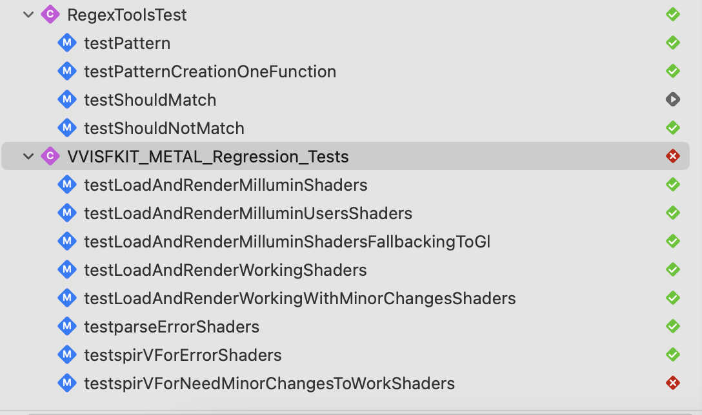

# Metal ISF

Metal ISF uses a fork of MoltenVK for shader conversion. For a quick try out, a CLI binary is included in the project. However, better performance is achieved by re-building MoltenVK libs on your machine.

## Quick setup (low performance)

__NO LONGER SUPPORTED - Requires Update__
Open vvopensource project and remove the missing files in VVISFKit/METAL/Converter
Comment the line `#define USE_MOLTENVK_LIB` from the file `MISFShaderConverter.mm`


## Standard setup (high performance)

MoltenVK is added in the folder `external` as a git submodule

After cloning, make sure to fetch the submodule with :
`git submodule init `
`git submodule update`
    

Then :
`cd external/MoltenVK/`
`brew install cmake python3 ninja`
`./fetchDependencies --macos`

Note : the fetchDependencies script gets the LATEST version of glsc and other tools. __It may cause regressions over time !!__. To have a consistent build, run those commands (v1.0 release)
```
cd SPIRV-Cross
git checkout de0e72a0
cd ../Volk/
git checkout 01986ac
cd ../Vulkan-Headers
git checkout tags/v1.3.280
cd ../Vulkan-Tools
git checkout tags/v1.3.280
cd ../cereal/
git checkout tags/v1.2.2
cd ../glslang/
git checkout tags/14.1.0
```

Then (this is to fix a bug discovered March 2024 -- hacky workaround for LM_HEAT.fs) : 
- Open up external/MoltenVK/ExternalDependencies.xcodeproj
- look for this line "replace_illegal_names(keywords);" and comment it

Then :
`./buildWithoutFetching --macos`

Lastly :
- open MoltenVKPackaging.xcodeproj
- build "MoltenVK Package (macOS only)"
- build "MoltenVKShaderConverter-macOS"
- Run VVISFKitTest Metal Regression and _make sure you have_ these results (v1.0) : Tests 9302 / Passed 8394 / Failed 908
- To avoid Millumin regressions : Make sure the tests are like this

- build VVISFKit
- Enjoy


## Tackle visual regressions
Updating library can cause visual regressions that are not detectable with unit tests. Look for IsfMetalVisualRegressionTestPack2024 for visual testing (not in this repo).


### Other issues
if error on "MVKImage.mm" file, comment line `_swapchain->recordPresentTime(presentTimingInfo, drawable.presentedTime * 1.0e9);`

### Contact
MTO